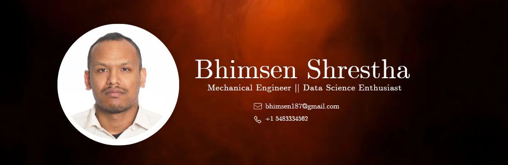

<h1 align="center">Hi 👋, I'm Bhimsen Shrestha</h1>
<h3 align="center">A Mechanical Engineer with a strong affinity for Data Science.</h3>

  

  

- 🔭 I’m currently working as **CNC Machine Operator** at **Linamar Performance Centre**

- 🌱 I’m currently learning **Python Programming, Google IT Support**

- 👨‍💻 All of my projects are available at [bstha@projects](bstha@projects)

- 💬 Ask me about **Mechanical Design and Data Science**

- 📫 Reach out to me at **bhimsen187@gmail.com**

- 📄 Know about my experiences [My CV](MyCV)

<h3 align="left">Connect with me:</h3>

<h3 align="left">Languages and Tools:</h3>

    

&nbsp;

